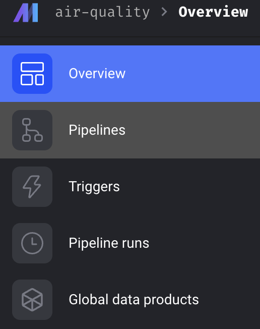
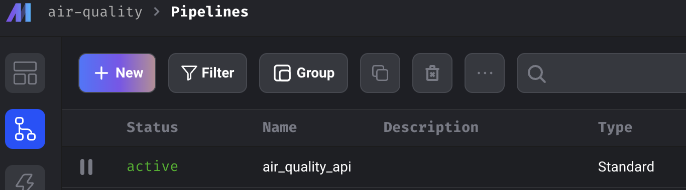
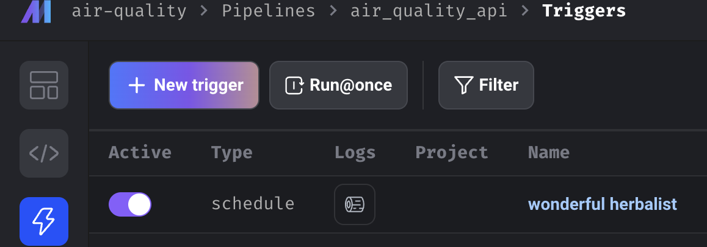
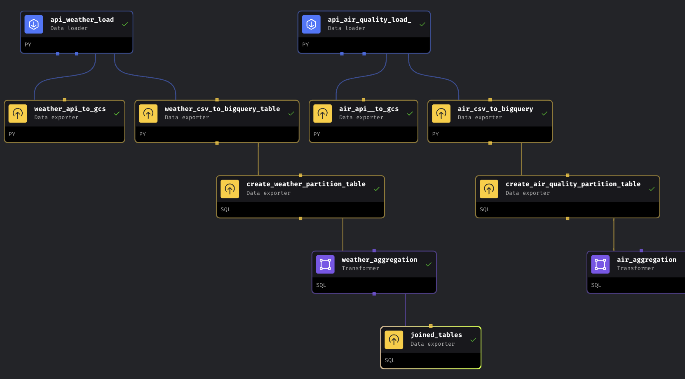
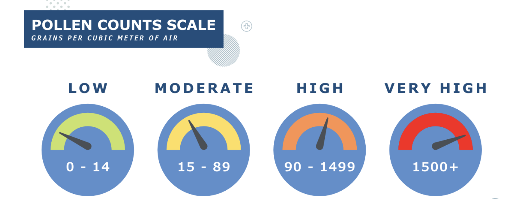
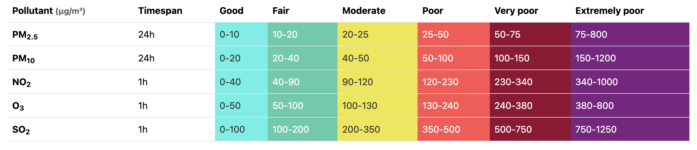
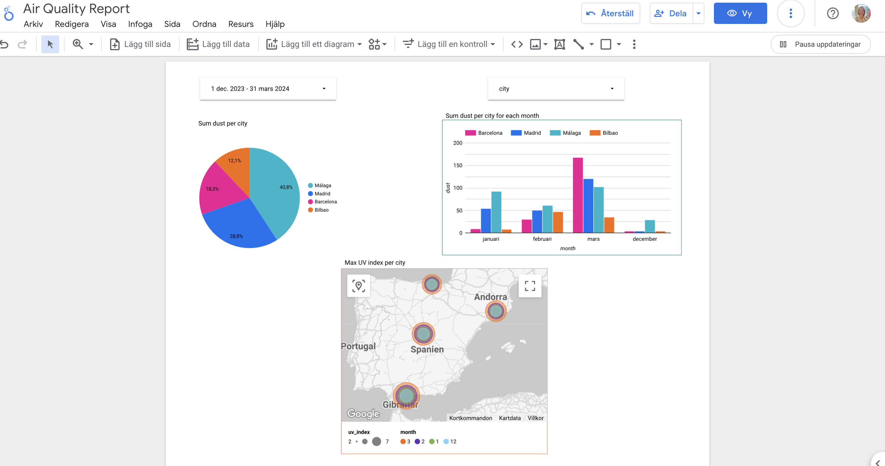
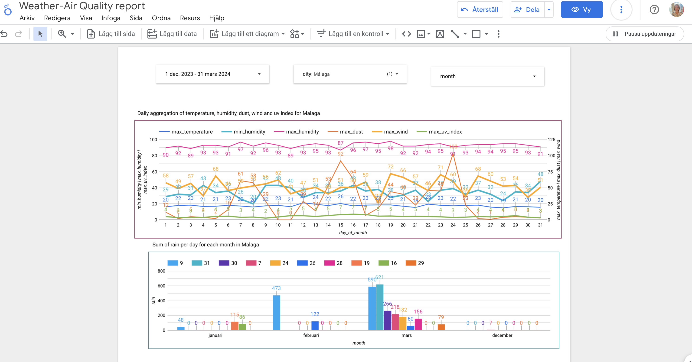

# Air Quality Project

- [Project Description](#project-description)
- [Prerequisites](#prerequisites)
- [Setting up GCP](#setting-up-gcp)
- [Running the Code](#running-the-code)
- [Creating Visualisations](#creating-visualisations)
- [Facts about Pollen](#facts-about-pollen)
- [Air Quality and Pollen](#air-quality-and-pollen)


## Project Description
This project contains an end-to-end data pipeline written in Python. 

This was my final project for [Data Engineering Zoomcamp](https://github.com/DataTalksClub/data-engineering-zoomcamp#data-engineering-zoomcamp) in the 2024 Cohort. 

The application uses the data from [Open-Meteo](https://open-meteo.com/) by reading from two APIs: 

1. [Air Quality API](https://open-meteo.com/en/docs/air-quality-api) and 
2. [Weather Forecast API](https://open-meteo.com/en/docs) 

**Pipeline description:**
- Pipeline fetches the data from APIs
- Then it transforms both data sets and uploads them to Google Cloud Storage. 
- In the next step this data is loaded from GCS into BigQuery.
- There we create a couple of tables with aggregated data. 

All steps are orchestrated in [Mage](https://docs.mage.ai/introduction/overview).

**Problem**:

**Weather and Air Quality Aggregator**: Collect historical and forecast data from various sources, aggregate the information to analyse trends over time, and generate comprehensive forecasts for different regions.

---

## Prerequisites
1. [Docker](https://docs.docker.com/engine/install/)
2. [Git](https://git-scm.com/book/en/v2/Getting-Started-Installing-Git)
3. [Terraform](https://developer.hashicorp.com/terraform/install)
4. Setup a GCP account

Before running the code you need to follow the steps below.

### Setting up GCP
Google Cloud is a suite of Cloud Computing services offered by Google that provides various services like compute, storage, networking, and many more. It is organised into Regions and Zones.

Setting up GCP would require a GCP account. A GCP account can be created for free on trial but would still require a credit card to signup.

1. Start by creating a GCP account at [this link](https://cloud.google.com/)
2. Navigate to the GCP Console and create a new project. Give the project an appropriate name and take note of the project ID.
3. Create a service account:

   - In the left sidebar, click on "IAM & Admin" and then click on "Service accounts."

   - Click the "Create service account" button at the top of the page.

   - Enter a name for your service account and a description (optional).

   - Select the roles you want to grant to the service account. For this project, select the BigQuery Admin, Storage Admin and Compute Admin Roles.

   - Click "Create" to create the service account.

   - After you've created the service account, you need to download its private key file. This key file will be used to authenticate requests to GCP services.

   - Click on the service account you just created to view its details.

   - Click on the "Keys" tab and then click the "Add Key" button.

   - Select the "JSON" key type and click "Create" to download the private key file. This key would be used to interact to the google API from Mage.

   - Store the json key as you please, but then copy it into the mage directory of this project  and
give it exactly the name `my-airquality-credentials.json`.

4. This application communicates with several APIs. Make sure you have enabled the BigQuery API.
- Go to [BigQuery API](https://console.cloud.google.com/apis/library/browse?hl=sv&project=air-quality-project-417718&q=bigquery%20api) and enable it.

---
## Running the Code
*Note: these instructions are used for macOS/Linux/WSL, for Windows it may differ*

1. Clone this repository
2. `cd` into the terraform directory. We are using **terraform** to create google cloud resorces. 
    My resources are created for region **EU**. If needed, you can change it in **variables.tf** file. In this file you need to change the **project ID** to the project ID you created in GCP.
3. To prepare your working directory for other commands we are using:

```bash
terraform init
```
4. To show changes required by the current configuration you can run:

```bash
terraform plan
```
5. To create or update infrastructure we are using:

```bash
terraform apply
```
6. To destroy previously-created infrastructure we are using:

```bash
terraform destroy
```
**IMPORTANT**: This line uses when you are done with the whole project.

7. `cd` into the mage directory
8. Rename `dev.env` to simply `.env`.

9. Now, let's build the container

```bash
docker compose build
```
10. Finally, start the Docker container:

```bash
docker compose up
```
11. We just initialized a mage repository. It is present in your project under the name `air-quality`. Now, navigate to http://localhost:6789 in your browser! 

This repository should have the following structure:

```
.
├── mage_data
│   └── air-quality
├── air-quality
│   ├── __pycache__
│   ├── charts
│   ├── custom
│   ├── data_exporters
│   ├── data_loaders
│   ├── dbt
│   ├── extensions
│   ├── interactions
│   ├── pipelines
│   ├── scratchpads
│   ├── transformers
│   ├── utils
│   ├── __init__.py
│   ├── io_config.yaml
│   ├── metadata.yaml
│   └── requirements.txt
├── .gitignore
├── .env
├── docker-compose.yml
├── Dockerfile
└── requirements.txt
```

12. Time to work with mage. Go to the browser, find **pipelines**, click on air_quality_api pipeline and click on Run@once. 

<table><tr>
<td>  </td>
<td>  </td>
<td>  </td>
<tr>
<td>Find pipeline</td>
<td>Pipeline </td>
<td>Run pipeline </td>
</tr>
</tr></table>


**IMPORTANT**: For some reason, an error may occur during the step of creating the 'air_aggregated' table, indicating '404 Not Found: Table air-quality-project-417718:air_quality.air_aggregated_data was not found in location EU.' However, if you navigate to BigQuery and refresh the database, the table should appear.

When you are done, in a google bucket you should have two CSV files and in the BigQuery you should have all tables. Your pipeline should look like this:



<br>
<br>

## Creating Visualisations

- With your google account, log in at [Google looker studio](https://lookerstudio.google.com/navigation/reporting)

- Connect your dataset using the Big Query Connector

- Select your project name then select the dataset. This would bring you to the dashboard page

- Create your visualizations and share.

<br>

### Facts about Pollen

A pollen count is the measurement of the number of grains of pollen in a cubic meter of air. High pollen counts can sometimes lead to increased rates of allergic reactions for those with allergic disorders.

Pollen, a fine to coarse powdery substance, is created by certain plants as part of their reproduction process. It can appear from trees in the spring, grasses in the summer, and weeds in the fall. Interestingly, pollen from flowers doesn’t usually contribute to nasal allergy symptoms.



---

As a general observation, most aeropalynology studies indicate that temperature and wind have a positive correlation with airborne pollen concentrations, while rainfall and humidity are negatively correlated.

---
### Air Quality and Pollen.

Urban areas tend to have lower pollen counts than the countryside, but pollen can combine with air pollution in the city center and bring on hay fever symptoms. It’s not just in the summer months either; it can peak as early as April and May.



<br >

<table><tr>
<td>  </td>
<td>  </td>
<tr>
<td>Air Quality Report 1</td>
<td>Air Quality Report 2</td>
</tr>
</tr></table>


[Home](#air-quality-project)